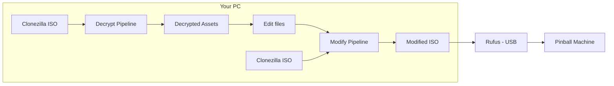
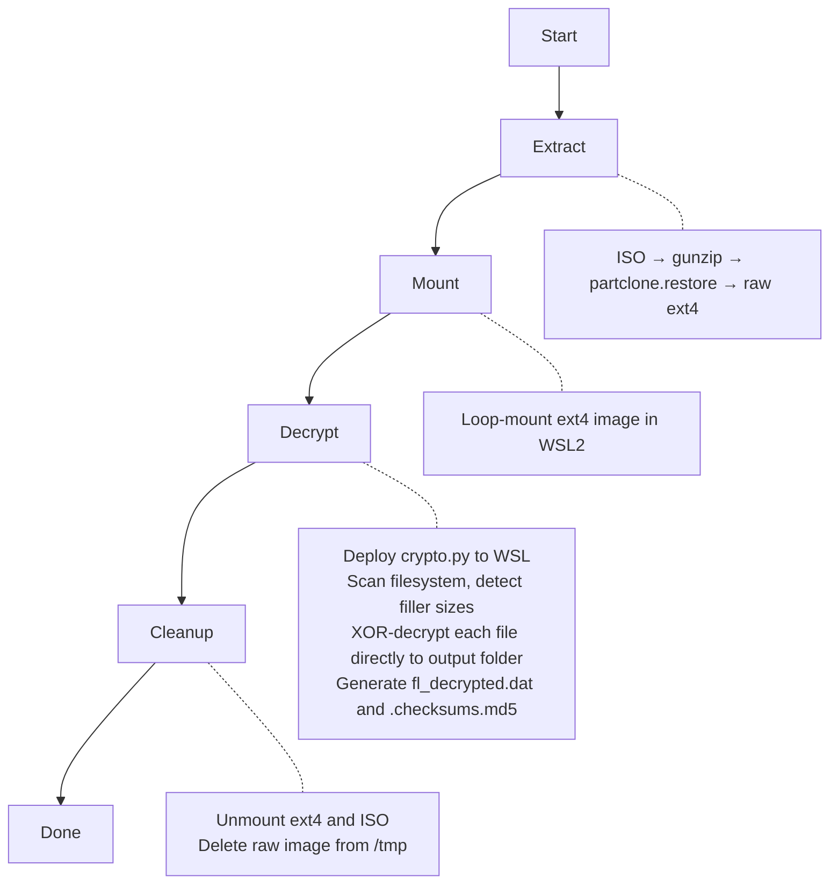
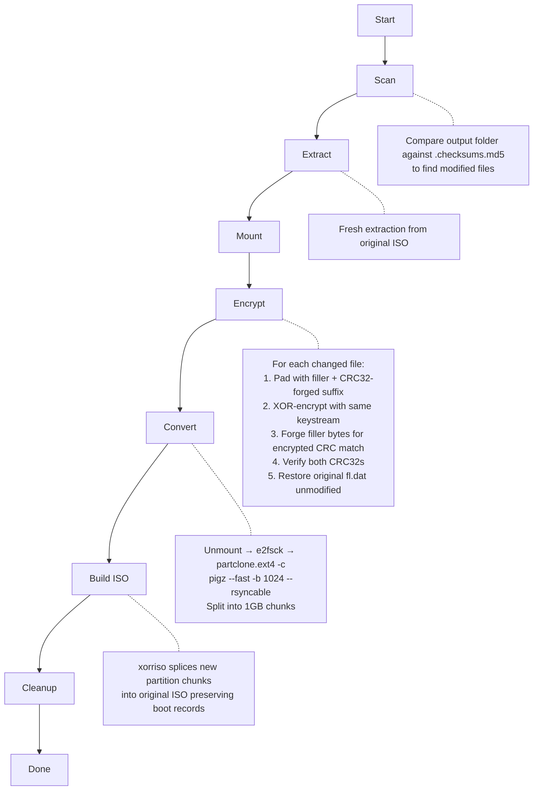

# JJP Asset Decryptor

A Windows GUI application for decrypting and modifying game assets on Jersey Jack Pinball (JJP) machines. The encryption algorithm has been fully reverse-engineered — **no USB dongle required**. Turns a complex multi-step process involving filesystem extraction, cryptographic decryption, and ISO rebuilding into a single button click.

## What It Does

JJP pinball machines store encrypted game assets (images, videos, audio, fonts) on their internal drives. Each machine ships with a Clonezilla backup ISO containing the full filesystem image. This tool:

1. **Decrypts** every asset in a game image using a fully reverse-engineered pure Python implementation of the game's custom PRNG and XOR cipher — no dongle or game binary needed
2. **Re-encrypts** modified assets back into the game image with CRC32 forgery so the game's integrity checks pass without touching the file list
3. **Produces a bootable Clonezilla ISO** ready to flash onto the machine via USB

## Supported Games

Confirmed working (26,000+ files decrypted across all four):

- Willy Wonka & the Chocolate Factory
- Guns N' Roses
- Elton John
- The Hobbit

Not yet tested (but should work — same platform and encryption scheme):

- Wizard of Oz
- Dialed In
- Toy Story
- The Godfather
- Avatar
- Harry Potter

## Requirements

- **Windows 10/11** with WSL2 enabled
- **WSL2** with Ubuntu (or similar): `wsl --install`
- **partclone** in WSL: `wsl -u root -- apt install partclone`
- **xorriso** in WSL: `wsl -u root -- apt install xorriso`
- **Game image**: Clonezilla ISO backup or raw ext4 filesystem image — download "full installs" from https://marketing.jerseyjackpinball.com/downloads/
- **Rufus** (for writing modified ISOs to USB): [rufus.ie](https://rufus.ie/)

No USB dongle, gcc, or usbipd-win required. No additional Python packages needed (uses only the standard library).

**Windows only.** The tool relies on WSL2 for Linux filesystem operations.

## Installation

### Option 1: Installer (Recommended)

1. Download `JJP_Asset_Decryptor_Setup.exe` from the [Releases page](https://github.com/davidvanderburgh/jjp-decryptor/releases)
2. Run the installer — it includes a bundled Python runtime (no Python installation needed)
3. When prompted, check **Install prerequisites** to set up WSL2, partclone, and xorriso
4. If WSL2 was just enabled, reboot and re-run the prerequisites installer from the Start Menu: **JJP Asset Decryptor > Install Prerequisites**

The app checks for updates automatically on startup and will notify you when a new version is available.

### Option 2: Run from Source

1. Install [Python 3.10+](https://www.python.org/downloads/) (Windows)
2. Clone the repository:
   ```
   git clone https://github.com/davidvanderburgh/jjp-decryptor.git
   cd jjp-decryptor
   ```
3. Install prerequisites manually (see Requirements above)
4. Launch:
   ```
   python -m jjp_decryptor
   ```
   You can also double-click `JJP Asset Decryptor.pyw` to launch without a console window, or run `create_shortcut.bat` to create a desktop shortcut.

## Usage

### Decrypting Assets

1. Launch the app
2. Prerequisites are checked automatically on startup (WSL2, partclone, xorriso)
3. Click **Browse** to select your game image (ISO or ext4)
4. Click **Browse** to select an output folder for decrypted assets
5. Click **Start Decryption**

The first run for a game will scan the filesystem and auto-detect filler sizes for every encrypted file. This generates an `fl_decrypted.dat` in the output folder which makes subsequent runs faster. The app remembers your last-used paths between sessions.

### Modifying Assets

After decrypting, you can replace game assets and re-encrypt them:

1. Switch to the **Modify Assets** tab
2. Ensure the **Game Image** points to the **original Clonezilla ISO** and the output folder contains your decrypted files
3. Replace files in the output folder (PNGs, WebMs, OGGs, WAVs, etc.)
4. Click **Apply Modifications** — the tool detects changed files via checksums, re-encrypts only what changed, forges CRC32 checksums to match the original file list, and builds a new bootable Clonezilla ISO
5. The output `<name>_modified.iso` is saved to your output folder

### Installing on the Machine

1. Write the `_modified.iso` to a USB drive using [Rufus](https://rufus.ie/)
   - **Important: Use ISO mode (not DD mode) when Rufus prompts you.** DD mode will not produce a bootable drive for Clonezilla ISOs on JJP hardware.
2. Boot the pinball machine from the USB drive
3. Clonezilla restores the image automatically

### File Format Notes

- Images: **PNG** (same dimensions as originals)
- Videos: **WebM** (same codec/resolution as originals)
- Audio: **WAV** or **OGG** (matching the original format)
- Format or dimension mismatches won't corrupt the image but may crash or glitch the game at runtime

## Architecture

```
jjp_decryptor/
├── __main__.py      # Entry point (python -m jjp_decryptor)
├── app.py           # Application controller — wires GUI ↔ pipeline via thread-safe queue
├── gui.py           # Tkinter GUI with dark/light theme, tabs, progress tracking
├── pipeline.py      # StandaloneDecryptPipeline and StandaloneModPipeline
├── crypto.py        # Pure Python PRNG, XOR cipher, filler detection, CRC32 forgery
├── filelist.py      # fl.dat parser/generator and filesystem scanner
├── resources.py     # Embedded C sources (legacy dongle-based hooks, kept for reference)
├── config.py        # Constants (paths, timeouts, known games, phase names)
├── wsl.py           # WSL2 command executor and Windows↔WSL path conversion
└── updater.py       # Auto-update checker (GitHub releases API)
```

The app uses a **background thread + queue** pattern: the pipeline runs in a worker thread and posts `LogMsg`, `PhaseMsg`, `ProgressMsg`, and `DoneMsg` objects to a queue. The main thread polls the queue at 100ms intervals to update the GUI.

## How the Encryption Works

JJP games encrypt all assets (PNG, WebM, WAV, OGG, TTF, TXT) using a custom scheme:

1. **`fl.dat`** (the file list) is encrypted with the HASP dongle's hardware crypto. The decrypted content is CSV with one entry per line:
   ```
   /full/path/to/file.png,filler_size,crc32_encrypted,crc32_decrypted
   ```
   This tool bypasses `fl.dat` entirely by scanning the filesystem and auto-detecting filler sizes using magic byte signatures and text heuristics.

2. **Each asset file** is encrypted by:
   - Seeding a custom PRNG with the file's full absolute path (BKDR hash, multiplier=131)
   - The PRNG combines an LCG, xorshift64, and 128-bit counter to produce a 64-bit keystream
   - XOR-ing the entire file with the keystream in **little-endian** byte order
   - Prepending `filler_size` random bytes before the actual content

3. **Filler size detection** (dongle-free): The filler is random bytes prepended to the real content. Without `fl.dat`, the tool detects where the filler ends using:
   - Magic byte signatures for known binary formats (PNG, WebM, WAV, OGG, TTF, etc.)
   - A two-phase text heuristic for text files: non-printable density scoring to find the transition zone, then word-score refinement to pinpoint the exact content start
   - 100% accuracy across 26,000+ files from all four tested games

4. **Integrity checking** at boot: the game computes CRC32 of each encrypted file on disk (must match `n2`) and CRC32 of the decrypted content after filler removal (must match `n3`). Any mismatch triggers `FILE CHECK ERROR`.

### CRC32 Forgery

Rather than modifying `fl.dat` (which would require the dongle's hardware crypto), the tool uses **CRC32 forgery** to make modified files produce the exact same checksums as the originals:

- **N3 forgery**: 4 bytes are appended to the decrypted content so its CRC32 equals the original `n3`
- **N2 forgery**: 4 bytes within the random filler are adjusted so the encrypted file's CRC32 equals the original `n2`

This means `fl.dat` is restored byte-for-byte from its original encrypted form — no dongle needed at any point.

## Pipeline Details

### End-to-End Flow



### Decrypt Pipeline



| Phase | What Happens |
|-------|-------------|
| **Extract** | Decompresses Clonezilla ISO's partclone image to raw ext4 |
| **Mount** | Loop-mounts the ext4 image read-only in WSL2 |
| **Decrypt** | Deploys `crypto.py` and `filelist.py` to WSL, scans the encrypted filesystem, auto-detects filler sizes, XOR-decrypts every file directly to the Windows output folder, and generates `fl_decrypted.dat` + `.checksums.md5` |
| **Cleanup** | Unmounts ext4 and ISO images, deletes the raw image from `/tmp` |

### Modify Pipeline



| Phase | What Happens |
|-------|-------------|
| **Scan** | Compares output folder against `.checksums.md5` baseline to identify modified files |
| **Extract** | Extracts a **fresh** ext4 image from the original ISO (never reuses previous images) |
| **Mount** | Loop-mounts the fresh ext4 image read-write |
| **Encrypt** | For each changed file: reads replacement content, encrypts with pure Python crypto, forges both CRC32 checksums, writes encrypted file back into the ext4 image. Restores original `fl.dat` unmodified |
| **Convert** | Unmounts ext4, runs `e2fsck -fy`, converts to partclone format with `pigz --fast -b 1024 --rsyncable`, splits into ~1GB chunks matching the original layout |
| **Build ISO** | Uses `xorriso` to splice the new partition chunks into the original ISO, preserving all boot records (MBR, El Torito, EFI, Syslinux) |
| **Cleanup** | Unmounts everything, removes temp files and raw images |

## Troubleshooting

### FILE CHECK ERROR on the machine
If the machine shows errors for ALL files after flashing:
- Ensure the ISO was written with Rufus in **ISO mode** (not DD mode)
- Check that the compression flags match the original (`pigz --fast -b 1024 --rsyncable`)

### Stale mounts from a previous crash
The app detects and cleans up stale mounts automatically on startup. If you have issues, you can manually clean up:
```
wsl -u root -- bash -c "findmnt -rn -o TARGET | grep /mnt/jjp_ | sort -r | xargs -r umount -lf; rmdir /mnt/jjp_* 2>/dev/null"
```

### Mount fails with "bad superblock"
This can happen if partclone.restore produces a truncated image. The tool automatically detects and fixes this by reading the ext4 superblock and extending the image to full filesystem size. If it still fails, delete cached images and retry:
```
wsl -u root -- rm -f /tmp/jjp_raw_*.img
```

## Building the Installer

To build the installer from source, you need [Inno Setup 6](https://jrsoftware.org/isinfo.php) installed.

```powershell
cd installer
powershell -NoProfile -ExecutionPolicy Bypass -File build.ps1
```

The build script:
1. Downloads a Python embeddable distribution with tkinter support
2. Reads the version from `jjp_decryptor/__init__.py`
3. Compiles the Inno Setup installer

Output: `installer/Output/JJP_Asset_Decryptor_Setup_v<version>.exe`

### Versioning

The version number lives in `jjp_decryptor/__init__.py` as `__version__`. To release a new version:

1. Bump `__version__` in `jjp_decryptor/__init__.py`
2. Run `installer/build.ps1` to build the installer
3. Commit, tag `v<version>`, push
4. Create a GitHub release and attach the installer `.exe`

Users running older versions will see an update notification on their next launch.

## License

MIT License. See [LICENSE](LICENSE) for details.
