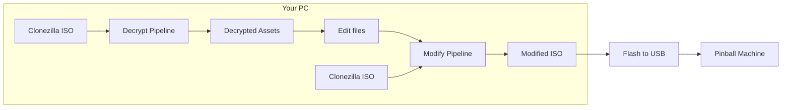
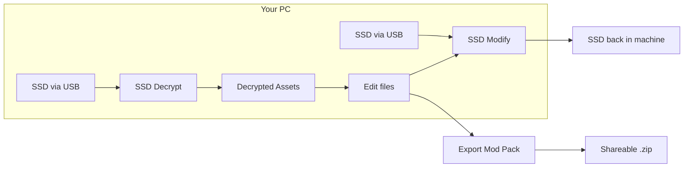
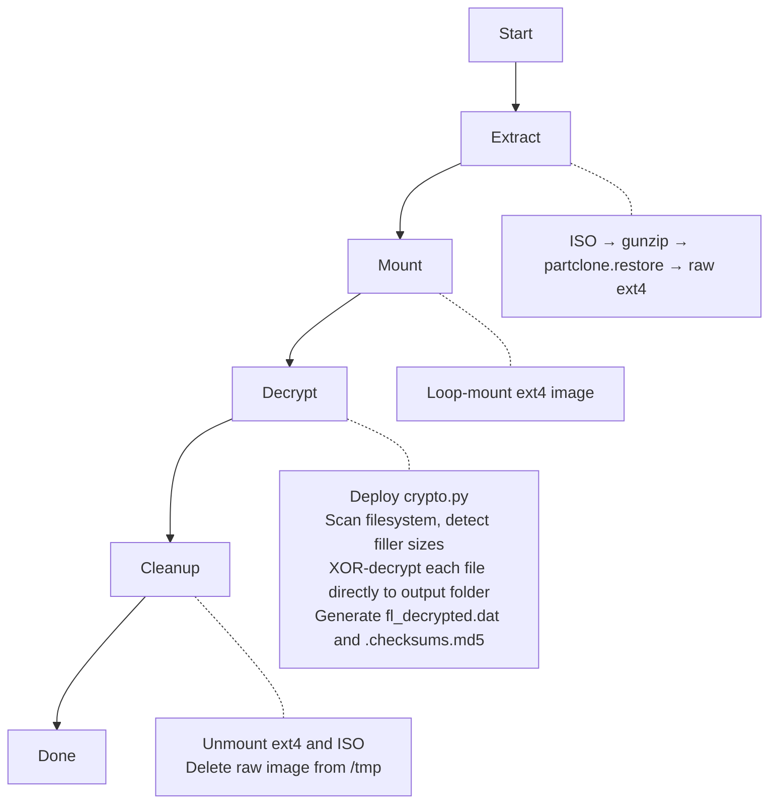
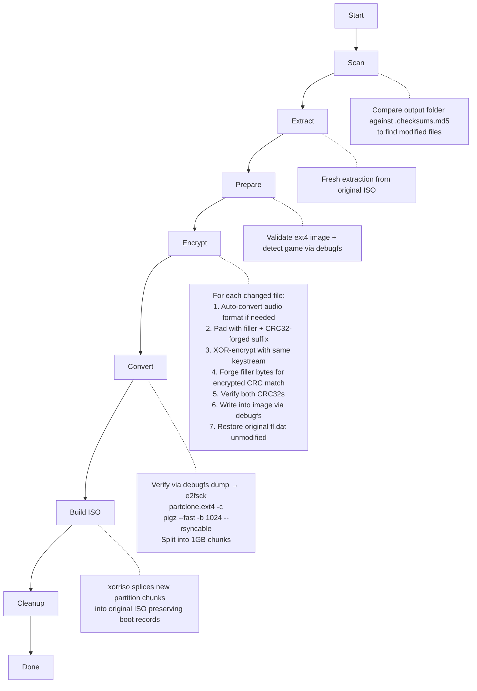
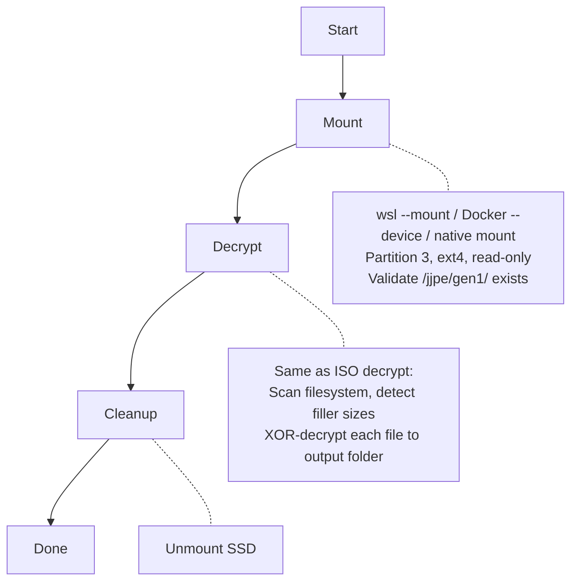
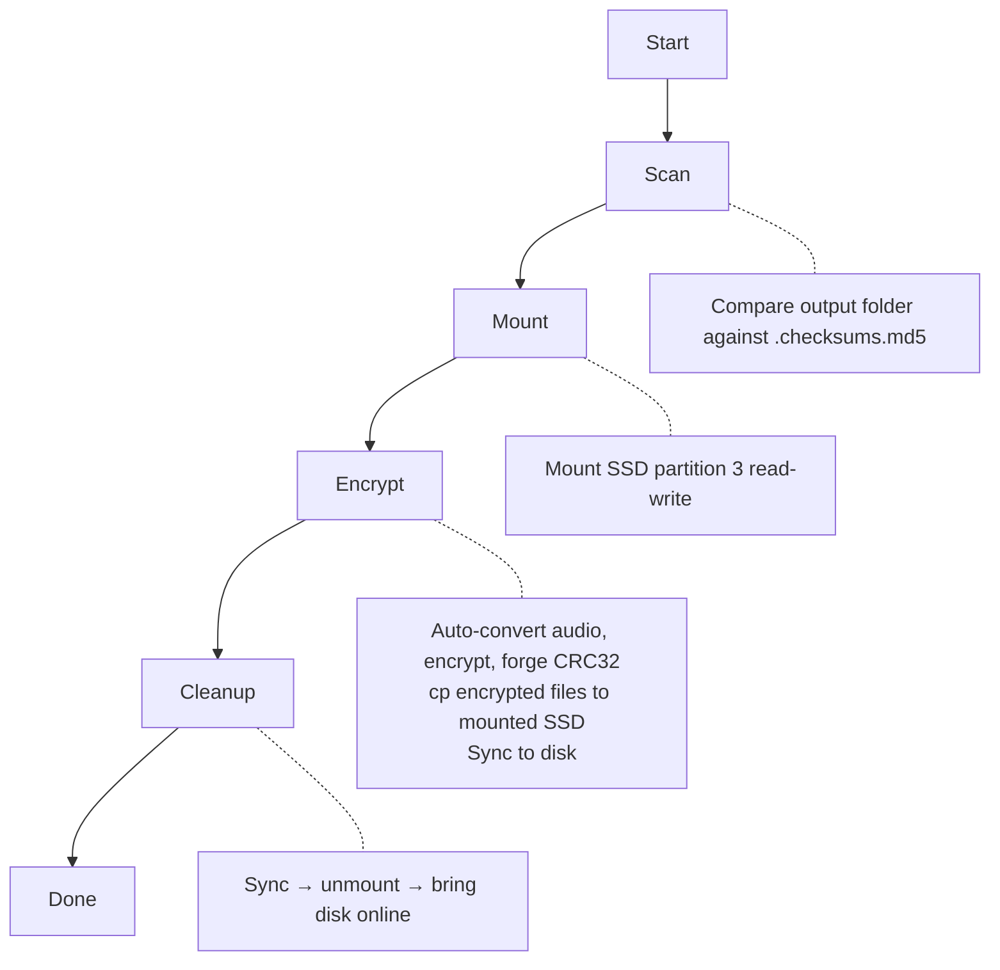

# JJP Asset Decryptor

A cross-platform GUI application for decrypting and modifying game assets on Jersey Jack Pinball (JJP) machines. Runs on Windows, macOS, and Linux. The encryption algorithm has been fully reverse-engineered — **no USB dongle required**. Turns a complex multi-step process involving filesystem extraction, cryptographic decryption, and ISO rebuilding into a single button click.

## What It Does

JJP pinball machines store encrypted game assets (images, videos, audio, fonts) on their internal drives. Each machine ships with a Clonezilla backup ISO containing the full filesystem image. This tool:

1. **Decrypts** every asset in a game image using a fully reverse-engineered pure Python implementation of the game's custom PRNG and XOR cipher — no dongle or game binary needed
2. **Re-encrypts** modified assets back into the game image with CRC32 forgery so the game's integrity checks pass without touching the file list
3. **Direct SSD mode**: Plug the machine's SSD into your computer via a USB enclosure and decrypt/modify files in place — no ISO extraction or rebuilding needed
4. **Produces a bootable Clonezilla ISO** ready to flash onto the machine via USB (alternative to direct SSD)
5. **Mod Packs**: Export your modified files as a shareable zip, or import mod packs from other users

## Supported Games

- Willy Wonka & the Chocolate Factory
- Guns N' Roses
- Elton John
- The Hobbit
- Wizard of Oz
- Dialed In
- Toy Story
- The Godfather
- Avatar
- Harry Potter

## Requirements

**Game source** — one of:
- **Clonezilla ISO** backup or raw ext4 filesystem image — download "full installs" from https://marketing.jerseyjackpinball.com/downloads/
- **Direct SSD** — the machine's physical SSD connected via a USB enclosure (see [USB Enclosures](#usb-enclosures-for-direct-ssd-mode) below)

No USB dongle, gcc, or usbipd-win required. No additional Python packages needed (uses only the standard library).

### Windows
- **Windows 10/11** with WSL2 enabled
- **WSL2** with Ubuntu (or similar): `wsl --install`
- **partclone**, **xorriso**, **e2fsprogs** (provides `debugfs`), **pigz**, and **ffmpeg** in WSL — the app has an **Install Missing** button that installs these automatically, or install manually: `wsl -u root -- apt install partclone xorriso e2fsprogs pigz ffmpeg`
- **Rufus** (for writing modified ISOs to USB): [rufus.ie](https://rufus.ie/)
- The app **auto-requests Administrator privileges** on launch (required for WSL disk mounting)

### macOS
- **Docker Desktop**: [docker.com/products/docker-desktop](https://www.docker.com/products/docker-desktop/)
- The app auto-builds a lightweight Alpine container with partclone/xorriso on first run
- **balenaEtcher** (for writing modified ISOs to USB): [etcher.balena.io](https://etcher.balena.io/)

### Linux
- Ubuntu/Debian:
  `sudo apt install partclone xorriso e2fsprogs pigz ffmpeg`
- openSUSE Tumbleweed:
  `sudo zypper install partclone xorriso e2fsprogs pigz ffmpeg`
- Requires `sudo` for the decrypt pipeline (loop-mounting ext4 images for read-only access)
- **dd** or **balenaEtcher** for writing modified ISOs to USB

## Installation

### Option 1: Pre-built Package (Recommended)

Download from the [Releases page](https://github.com/davidvanderburgh/jjp-decryptor/releases):

- **Windows**: `JJP_Asset_Decryptor_Setup.exe` — includes bundled Python runtime
- **macOS**: `JJP_Asset_Decryptor.dmg` — drag to Applications (see macOS note below)

**Windows installer note**: When prompted, check **Install prerequisites** to set up WSL2, partclone, xorriso, debugfs, pigz, and ffmpeg. If WSL2 was just enabled, reboot and re-run the prerequisites installer from the Start Menu.

**macOS note**: On first launch, macOS will block the app because it is not notarized with Apple. This is a one-time setup:

1. Open the app normally — you'll see a warning that Apple cannot verify it
2. Go to **System Settings → Privacy & Security**
3. Scroll down and click **"Open Anyway"** next to the JJP Asset Decryptor message
4. The app will launch and won't require this again

Docker Desktop must also be installed and running. The app auto-builds a lightweight Alpine container with partclone and xorriso on first run.

The app checks for updates automatically on startup and will notify you when a new version is available.

### Option 2: Run from Source

1. Install [Python 3.10+](https://www.python.org/downloads/)
2. Clone the repository:
   ```
   git clone https://github.com/davidvanderburgh/jjp-decryptor.git
   cd jjp-decryptor
   ```
3. Install prerequisites manually (see Requirements above)
4. Launch:
   ```
   python -m jjp_decryptor
   ```
   On Windows, you can also double-click `JJP Asset Decryptor.pyw` to launch without a console window, or run `create_shortcut.bat` to create a desktop shortcut.

### Option 3: Docker Container

Run the decryptor as a Docker container with zero installation — all dependencies are bundled in the image.

```bash
# Decrypt game assets
docker run --privileged --rm \
  -v /path/to/isos:/data \
  -v /path/to/output:/output \
  ghcr.io/davidvanderburgh/jjp-decryptor \
  decrypt -i /data/game.iso -o /output

# Modify assets and rebuild ISO
docker run --privileged --rm \
  -v /path/to/isos:/data \
  -v /path/to/output:/output \
  ghcr.io/davidvanderburgh/jjp-decryptor \
  mod -i /data/game.iso -a /output
```

`--privileged` is required for loop-mounting filesystem images inside the container. The `-v` flags mount your local directories into the container so it can read the ISO and write output files.

## Usage

The app has three tabs: **Decrypt**, **Write**, and **Mod Pack**.

### Decrypt Tab

Decrypt game assets from a Clonezilla ISO or directly from the machine's SSD.

**From ISO:**
1. Launch the app
2. Prerequisites are checked automatically — click **Install Missing** if anything is missing
3. Select **From ISO** and browse to your game image
4. Set an output folder for decrypted assets
5. Click **Start Decryption**

**From SSD (recommended — faster):**
1. Power off the pinball machine and remove the SSD
2. Connect the SSD to your computer via a [USB enclosure](#usb-enclosures-for-direct-ssd-mode)
3. Select **From Game SSD** — the app auto-detects USB drives (internal drives are filtered out for safety)
4. Select the drive and confirm it's the correct one
5. Click **Start Decryption** — the drive is mounted read-only

The first run scans the filesystem and auto-detects filler sizes for every encrypted file, generating `fl_decrypted.dat` in the output folder for faster subsequent runs. The app remembers your last-used paths between sessions.

### Write Tab

After decrypting, replace game assets in the output folder (PNGs, WebMs, OGGs, WAVs, etc.) and write them back. The Write tab shows a preview of all modified files before writing.

**Write to SSD (recommended — instant):**
1. Select **Write to Game SSD** and pick the USB-connected drive
2. Review the modified files in the preview tree
3. Click **Start** — the tool encrypts changed files with CRC32 forgery and writes them directly to the SSD
4. Put the SSD back in the machine — no USB flashing needed

**Build USB ISO (traditional):**
1. Select **Build USB ISO** and browse to the **original Clonezilla ISO**
2. Click **Start** — the tool builds a new bootable ISO with your modifications
3. Write the `_modified.iso` to a USB drive:
   - **Windows**: Use [Rufus](https://rufus.ie/) — **select ISO mode (not DD mode)** when prompted
   - **macOS/Linux**: Use [balenaEtcher](https://etcher.balena.io/) or `dd`
4. Boot the pinball machine from the USB drive — Clonezilla restores the image automatically

Detailed flashing instructions: [Windows (PDF)](https://marketing.jerseyjackpinball.com/general/install-full/JJP_USB_UPDATE_PC_instructions.pdf) | [Mac (PDF)](https://marketing.jerseyjackpinball.com/general/install-full/JJP_USB_UPDATE_MAC_instructions.pdf)

### Mod Pack Tab

Share modifications with other users without sharing entire game images.

**Export a mod pack:**
1. Decrypt the game and modify files in the output folder
2. Switch to the **Mod Pack** tab and click **Export Mod Pack**
3. Choose a save location — the zip contains only modified files plus metadata

**Import a mod pack:**
1. Decrypt your own game first (from ISO or SSD) to create the output folder
2. Click **Import Mod Pack** and select the zip
3. Use the **Write** tab to write the changes to SSD or build a USB ISO

Mod packs are small (only changed files) and game-specific. They work across machines running the same game.

### USB Enclosures for Direct SSD Mode

The machine's SSD connects to your computer via a USB enclosure. The app only shows USB-connected external drives (internal drives are filtered out for safety). You'll need one of these depending on your SSD type:

- **SATA SSD** (most JJP machines): [USB-to-SATA enclosure](https://a.co/d/0aTa0PdC) — standard 2.5" SATA
- **NVMe SSD** (newer machines): [USB-to-NVMe enclosure](https://a.co/d/0ej7sNtG)

**Platform details:**
- **Windows**: Uses `wsl --mount`. The app auto-requests Administrator privileges on launch.
- **macOS**: Uses Docker with `--device` passthrough. Requires Docker Desktop.
- **Linux**: Uses native `mount -t ext4`. Requires root.

> Always keep your original Clonezilla ISO as a backup. The tool validates that the SSD contains a JJP game partition before proceeding.

### File Format Notes

- Images: **PNG** (same dimensions as originals)
- Videos: **WebM** with VP9 codec (must match original resolution — see below)
- Audio: **WAV** or **OGG** — both are **auto-converted** if they don't match the original's format

#### Audio Auto-Conversion

JJP games are strict about audio format — a mismatch in sample rate, bit depth, or channel count can cause the game to reject the file or ignore it. Different games, and even different files within the same game, use different specs (e.g. Hobbit has mono/44.1kHz, stereo/44.1kHz, and stereo/48kHz WAV files; song-select previews are stereo/44.1kHz/112kbps OGG Vorbis).

The mod pipeline automatically detects format mismatches and converts replacement audio files to match the original:

- **WAV bit depth** (8/16/24/32-bit) and **channel count** (mono/stereo) changes are handled in pure Python — no extra tools needed
- **WAV sample rate** changes (e.g. 48kHz → 44.1kHz) use ffmpeg, installed on-demand in WSL/Docker if needed
- **OGG Vorbis** files are checked for channel count, sample rate, and bitrate — mismatches are re-encoded via ffmpeg to match the original
- **Compressed WAV** files (non-PCM codecs like ADPCM or MP3-in-WAV) are converted via ffmpeg

The conversion is logged so you can see exactly what was changed:
```
Audio format mismatch: 2ch->1ch, 48000Hz->44100Hz
Converted (ffmpeg): 2ch/16bit/48000Hz -> 1ch/16bit/44100Hz

OGG format mismatch: 1ch->2ch, 48000Hz->44100Hz, 128kbps->112kbps
Converted (ffmpeg): 1ch/48000Hz/128kbps -> 2ch/44100Hz/112kbps
```

#### Video Format

All JJP games use **WebM container with VP9 codec** for video. Unlike audio, the game does not strictly validate video parameters — it decodes video through FFmpeg's libavformat/libavcodec, which handles format variations gracefully. However, replacement videos should:

- Use **WebM** container with **VP9** codec
- Match the **original resolution** — each video asset is sized for a specific screen region, so a different resolution will display at the wrong size
- Preserve the **alpha channel** for overlay videos (files named `*.a.webm`) which use transparency

Video files are not auto-converted because resolution changes are creative decisions, and re-encoding video is computationally expensive.

## Architecture

```
jjp_decryptor/
├── __main__.py      # GUI entry point (python -m jjp_decryptor), auto-elevates to admin on Windows
├── cli.py           # CLI entry point for Docker/headless use (python -m jjp_decryptor.cli)
├── app.py           # Application controller — wires GUI ↔ pipeline via thread-safe queue
├── gui.py           # Tkinter GUI with dark/light theme, 3 tabs (Decrypt/Write/Mod Pack)
├── pipeline.py      # Standalone, Direct SSD, and ISO pipelines + mod pack export/import
├── audio.py         # WAV/OGG format detection and pure Python audio conversion
├── crypto.py        # Pure Python PRNG, XOR cipher, filler detection, CRC32 forgery
├── filelist.py      # fl.dat parser/generator and filesystem scanner
├── guide.py         # Audio guide generator — scans game folders and produces structured summaries
├── resources.py     # Embedded C sources (legacy dongle-based hooks, kept for reference)
├── config.py        # Constants (paths, timeouts, known games, phase names)
├── executor.py      # Platform-aware command executor (WSL/Docker/Native) + USB drive detection
├── wsl.py           # Backward-compat wrapper (imports from executor.py)
└── updater.py       # Auto-update checker (GitHub releases API)
```

The app uses a **background thread + queue** pattern: the pipeline runs in a worker thread and posts `LogMsg`, `PhaseMsg`, `ProgressMsg`, and `DoneMsg` objects to a queue. The main thread polls the queue at 100ms intervals to update the GUI.

## How the Encryption Works

JJP games encrypt all assets (PNG, WebM, WAV, OGG, TTF, TXT) using a custom scheme:

1. **`fl.dat`** (the file list) is encrypted with the HASP dongle's hardware crypto. The decrypted content is CSV with one entry per line:
   ```
   /full/path/to/file.png,filler_size,crc32_encrypted,crc32_decrypted
   ```
   This tool bypasses `fl.dat` entirely by scanning the filesystem and auto-detecting filler sizes using magic byte signatures and text heuristics.

2. **Each asset file** is encrypted by:
   - Seeding a custom PRNG with the file's full absolute path (BKDR hash, multiplier=131)
   - The PRNG combines an LCG, xorshift64, and 128-bit counter to produce a 64-bit keystream
   - XOR-ing the entire file with the keystream in **little-endian** byte order
   - Prepending `filler_size` random bytes before the actual content

3. **Filler size detection** (dongle-free): The filler is random bytes prepended to the real content. Without `fl.dat`, the tool detects where the filler ends using:
   - Magic byte signatures for known binary formats (PNG, WebM, WAV, OGG, TTF, etc.)
   - A two-phase text heuristic for text files: non-printable density scoring to find the transition zone, then word-score refinement to pinpoint the exact content start
   - 100% accuracy across 26,000+ files from all four tested games

4. **Integrity checking** at boot: the game computes CRC32 of each encrypted file on disk (must match `n2`) and CRC32 of the decrypted content after filler removal (must match `n3`). Any mismatch triggers `FILE CHECK ERROR`.

### CRC32 Forgery

Rather than modifying `fl.dat` (which would require the dongle's hardware crypto), the tool uses **CRC32 forgery** to make modified files produce the exact same checksums as the originals:

- **N3 forgery**: 4 bytes are appended to the decrypted content so its CRC32 equals the original `n3`
- **N2 forgery**: 4 bytes within the random filler are adjusted so the encrypted file's CRC32 equals the original `n2`

This means `fl.dat` is restored byte-for-byte from its original encrypted form — no dongle needed at any point.

## Pipeline Details

### End-to-End Flow

**ISO Workflow** (traditional):


**Direct SSD Workflow** (recommended — no ISO needed):


### Decrypt Pipeline



| Phase | What Happens |
|-------|-------------|
| **Extract** | Decompresses Clonezilla ISO's partclone image to raw ext4 |
| **Mount** | Loop-mounts the ext4 image read-only (via WSL2, Docker, or native depending on platform) |
| **Decrypt** | Deploys `crypto.py` and `filelist.py`, scans the encrypted filesystem, auto-detects filler sizes, XOR-decrypts every file directly to the output folder, and generates `fl_decrypted.dat` + `.checksums.md5` |
| **Cleanup** | Unmounts ext4 and ISO images, deletes the raw image from `/tmp` |

### Modify Pipeline



| Phase | What Happens |
|-------|-------------|
| **Scan** | Compares output folder against `.checksums.md5` baseline to identify modified files |
| **Extract** | Extracts a **fresh** ext4 image from the original ISO (never reuses previous images) |
| **Prepare** | Validates the ext4 image and detects the game name using `debugfs` (no mount needed) |
| **Encrypt** | For each changed file: reads replacement content, auto-converts audio if format mismatches original (WAV/OGG), encrypts with pure Python crypto, forges both CRC32 checksums, writes encrypted file directly into the ext4 image via `debugfs`. Restores original `fl.dat` unmodified |
| **Convert** | Verifies modifications via `debugfs dump`, runs `e2fsck -fy`, converts to partclone format with `pigz --fast -b 1024 --rsyncable`, splits into ~1GB chunks matching the original layout |
| **Build ISO** | Uses `xorriso` to splice the new partition chunks into the original ISO, preserving all boot records (MBR, El Torito, EFI, Syslinux) |
| **Cleanup** | Removes temp files and staging directory |

### Direct SSD Decrypt Pipeline



### Direct SSD Modify Pipeline



| Phase | What Happens |
|-------|-------------|
| **Mount** | Platform-aware mount of SSD partition 3 (ext4). Read-only for decrypt, read-write for modify. On Windows: takes disk offline, clears stale WSL mounts, attaches via `wsl --mount`, validates `/jjpe/gen1/` exists |
| **Decrypt** | Identical to ISO decrypt — scans, detects fillers, XOR-decrypts to output folder |
| **Scan** | Same checksum comparison as ISO modify — finds changed files |
| **Encrypt** | Pure Python encryption with CRC32 forgery — copies encrypted files directly to the mounted SSD filesystem |
| **Cleanup** | Syncs filesystem, detaches SSD from WSL, brings disk back online for safe ejection |

## Troubleshooting

### FILE CHECK ERROR on the machine
If the machine shows errors for ALL files after flashing:
- **Windows**: Ensure the ISO was written with Rufus in **ISO mode** (not DD mode)
- **macOS/Linux**: Ensure the ISO was written with balenaEtcher or `dd` (not a drag-and-drop file copy)
- Check that the compression flags match the original (`pigz --fast -b 1024 --rsyncable`)

### Rufus warnings when writing the ISO (Windows)
Rufus may show two warnings when writing a JJP ISO to USB. Both are expected:

1. **"Revoked UEFI bootloader detected"** — The JJP Clonezilla ISOs ship with an older GRUB/shim that has been added to the UEFI revocation list. Click **OK** — JJP pinball machines do not use UEFI Secure Boot, so this is harmless.
2. **"Download required" (GRUB version mismatch)** — Rufus detects the ISO uses an older GRUB (e.g. 2.12) and offers to download a matching `core.img`. Click **Yes** to let Rufus download it. Using a mismatched GRUB version can cause the machine to ignore the USB entirely.

### Machine ignores the USB update
If the machine recognizes the USB stick but does not boot from it:
- **Use ISO mode in Rufus** (not DD mode) when prompted
- **Click Yes on the GRUB download prompt** (see above) — a mismatched GRUB version is the most common cause
- **Try a USB 2.0 stick, 8 GB or smaller** — some JJP hardware cannot boot from USB 3.0 or large-capacity drives
- **Try a different USB port** on the machine
- **Power the machine off completely** (not standby), insert the USB, then power on

### Output folder is empty after decryption (USB/external drive)
WSL2 only sees Windows drives that were connected when WSL started. If you plugged in a USB or external drive after booting, WSL silently writes to its own virtual filesystem instead of the real drive — the pipeline appears to succeed but nothing ends up on the drive. Fix:
1. Run `wsl --shutdown` in a Windows terminal
2. Retry (WSL restarts and detects the drive)

Alternatively, decrypt to a folder on C: and copy the files afterward.

### Mount fails with "No such file or directory" (WSL1)
If you see mount errors even though the file exists, your WSL distribution may be running WSL version 1 instead of 2. WSL1 does not support loop-mounting. Fix:
1. Run `wsl --update` in a Windows terminal (must be done first — step 2 won't work without it)
2. Run `wsl --set-version Ubuntu 2` (replace `Ubuntu` with your distro name)
3. Restart the app

### Stale mounts from a previous crash
The app detects and cleans up stale mounts automatically on startup. If you have issues, you can manually clean up:
```
wsl -u root -- bash -c "findmnt -rn -o TARGET | grep /mnt/jjp_ | sort -r | xargs -r umount -lf; rmdir /mnt/jjp_* 2>/dev/null"
```

### Mount fails with "bad superblock"
This can happen if partclone.restore produces a truncated image. The tool automatically detects and fixes this by reading the ext4 superblock and extending the image to full filesystem size. If it still fails, delete cached images and retry:
```
wsl -u root -- rm -f /var/tmp/jjp_raw_*.img
```

## Building the Installer

### Windows

Requires [Inno Setup 6](https://jrsoftware.org/isinfo.php).

```powershell
cd installer
powershell -NoProfile -ExecutionPolicy Bypass -File build.ps1
```

Output: `installer/Output/JJP_Asset_Decryptor_Setup_v<version>.exe`

### macOS

Requires Python 3.10+ with tkinter and PyInstaller.

```bash
bash installer/build_macos.sh
```

Output: `installer/Output/JJP_Asset_Decryptor_v<version>.dmg`

### Versioning

The version number lives in `jjp_decryptor/__init__.py` as `__version__`. To release a new version:

1. Bump `__version__` in `jjp_decryptor/__init__.py`
2. Commit and push
3. Tag and push: `git tag v<version> && git push origin v<version>`
4. GitHub Actions builds both installers and attaches them to the release automatically

Users running older versions will see an update notification on their next launch.

## License

MIT License. See [LICENSE](LICENSE) for details.
